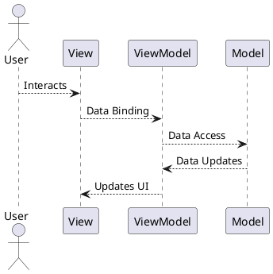
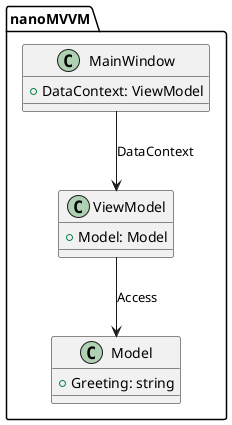
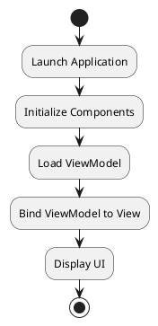

# nanoMVVM

This is a simple C# .NET WPF project that demonstrates the Model-View-ViewModel (MVVM) design pattern using Microsoft Visual Studio Professional 2019. The application displays a greeting message using data binding between a ViewModel and a Model.

---

## Features

- Implements MVVM design pattern for clear separation of concerns.
- Uses WPF's XAML for UI definition.
- Demonstrates data binding between ViewModel and View.
- Simple architecture suitable for learning MVVM.

---

## Project Structure

```plaintext
nanoMVVM/
├── App.xaml              - Application entry point (XAML)
├── App.xaml.cs           - Code-behind for application logic
├── MainWindow.xaml       - Main window layout (XAML)
├── MainWindow.xaml.cs    - Code-behind for the main window
├── Model.cs              - Represents the data structure (Model)
├── ViewModel.cs          - Contains application logic and data binding (ViewModel)
├── nanoMVVM.csproj       - Project configuration
└── README.md             - Documentation
```

---

## How It Works

The project uses the MVVM pattern to separate the UI (View) from business logic (ViewModel) and data (Model).

### Data Flow in MVVM



### Components

1. **Model (`Model.cs`)**

   - Contains the application data. In this example, it provides a simple greeting message.

2. **ViewModel (`ViewModel.cs`)**

   - Acts as a bridge between the View and the Model.
   - Provides data-binding properties and commands for the View.

3. **View (`MainWindow.xaml` and `MainWindow.xaml.cs`)**
   - Defines the user interface and binds to the ViewModel for displaying data.

---

## Setup and Build Instructions

### Prerequisites

- Microsoft Visual Studio Professional 2019
- .NET Framework

### Steps

1. Clone the repository:

   ```bash
   git clone https://github.com/MinimalWindowsDev/nanoMVVM.git
   cd nanoMVVM
   ```

2. Open `nanoMVVM.sln` in Visual Studio.

3. Build the solution:

   - Go to the **Build** menu and select **Rebuild Solution**.

4. Run the application:
   - Press `F5` or go to **Debug > Start Debugging**.

---

## Usage

When you launch the application, you will see a simple window displaying the greeting message:  
**"Hello, MVVM!"**

---

## PlantUML Visualizations

### MVVM Architecture



### Application Workflow



---

## Future Enhancements

- Add commands for user interactions.
- Extend the application to handle complex data structures.
- Implement unit tests for ViewModel logic.
- Enhance the UI with custom controls and styles.

---

## License

This project is licensed under the [MIT License](LICENSE).
